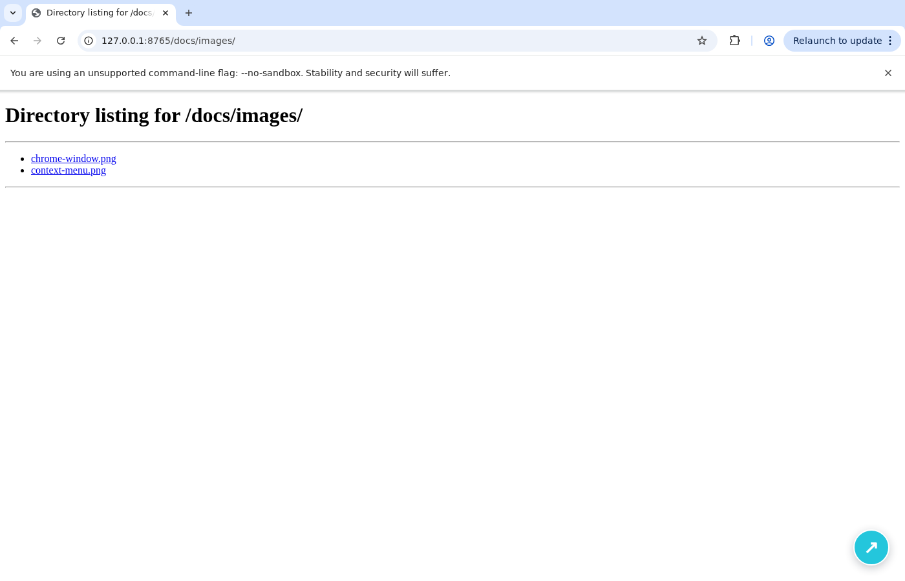
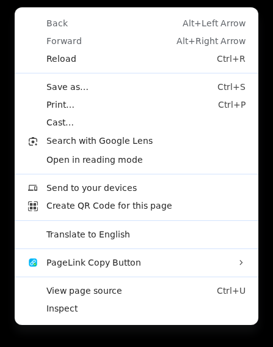

# PageLink Copy Button

ページタイトルと URL を、クリックひとつでハイパーリンクとしてコピーできる Chrome 拡張機能です。

## 画面イメージ

### 拡張機能アイコン


### ページ上のコピーボタン

ページ右下に表示される実際のボタンです。ドラッグして好きな位置へ移動できます。



### Chrome の右クリックメニュー

ページ上で通常の右クリックをすると、Chrome のコンテキストメニューから PageLink Copy Button を選べます。



Chrome の仕様により、拡張機能の項目は `PageLink Copy Button` のサブメニューにまとめて表示されます。サブメニューから「ページリンクをコピー」「PageLink ボタンを表示」「PageLink ボタンを非表示」を選択できます。

## セットアップ

現在は Chrome ウェブストア未公開です。main ブランチへマージされると GitHub Actions が Chrome 用のビルドを実行し、リポジトリ内の `extension/` を更新します。一般ユーザーは Bun をインストールしたりビルドしたりせず、そのディレクトリを Chrome に読み込めます。

### 事前に用意するもの

- Google Chrome
- Git（コマンドでリポジトリを取得する場合）

Chrome ウェブストアからインストールする拡張機能ではないため、Chrome のデベロッパー モードを使用します。Bun、Node.js、TypeScript などの開発環境は必要ありません。

### 1. リポジトリを取得する

#### Gitを使う場合

ターミナルで次のコマンドを実行します。

```bash
git clone https://github.com/toshi-hm/pagelink-copy-button.git
cd pagelink-copy-button
```

#### ZIPで取得する場合

Gitを使わない場合は、GitHubの「Code」ボタンから「Download ZIP」を選択して展開します。展開したフォルダーが、以降の手順でいうリポジトリフォルダーです。

`extension/manifest.json` が存在することを確認してください。フォルダー構成は次のようになっています。

```text
pagelink-copy-button/
└── extension/
    └── manifest.json
```

mainへのマージ直後などで `extension/` がまだ存在しない、または更新中の場合は、GitHub Actions の `Build extension` が完了するまで待ってから取得してください。

### 2. Chromeに読み込む

1. Chrome で `chrome://extensions` を開きます。
2. 右上の「デベロッパー モード」を有効にします。
3. 「パッケージ化されていない拡張機能を読み込む」をクリックします。
4. 取得したリポジトリ内の `extension/` フォルダーを選択します。

Chromeのファイル選択画面で `manifest.json` が表示される場所が正しい選択先です。`pagelink-copy-button/` そのものや、`extension/` の中にある個別ファイルは選択しないでください。

読み込みが完了すると、拡張機能の一覧に「PageLink Copy Button」が表示されます。必要に応じて拡張機能カードのピン留めボタンから、ツールバーにアイコンを固定してください。

### 3. ページを再読み込みする

インストール後に開いていたページでは、拡張機能のボタンがすぐに表示されない場合があります。その場合は対象ページを再読み込みしてください。

### 更新する

Gitで取得した場合は、リポジトリフォルダーで次のコマンドを実行し、Chromeの拡張機能一覧にある再読み込みボタンを押します。

```bash
git pull
```

ZIPで取得した場合は、GitHubから最新のZIPをダウンロードして展開し、Chromeの拡張機能一覧で古い拡張機能を削除してから、新しい `extension/` を読み込んでください。

### うまく読み込めない場合

- 「manifest file is missing」などと表示される場合は、リポジトリのルートではなく `extension/` を選択してください。
- `extension/` がない場合は、mainブランチの最新のGitHub Actionsで `Build extension` が完了していることを確認してから、もう一度取得してください。
- 拡張機能を読み込めてもボタンが表示されないページは、[`chrome://` ページなどの保護されたページ](#注意事項)の可能性があります。

## 使い方

### ページリンクをコピーする

ページを開くと、右下に水色のボタンが表示されます。ボタンを押すと、ページタイトルを表示文字列にしたリンクがクリップボードへコピーされます。

コピーに成功するとボタンが緑色になり、チェックマークが表示されます。しばらくすると水色へ戻ります。

### ボタンを移動する

ボタンをドラッグすると好きな位置へ移動できます。ボタンは画面外へ出ないように配置され、位置は保存されます。

### 右クリックメニューを使う

ページ上の任意の場所で通常の右クリックをすると、次の項目を選べます。

- 「ページリンクをコピー」: 現在のページのタイトルと URL をコピー
- 「PageLink ボタンを表示」: ページ上のボタンを表示
- 「PageLink ボタンを非表示」: ページ上のボタンを非表示

右上の拡張機能アイコンから popup を開くと、ボタンの表示・非表示の切り替えと位置のリセットもできます。

## 注意事項

`chrome://` ページ、Chrome ウェブストア、その他のブラウザ保護ページでは Chrome の制限によりボタンを表示できません。

<details>
<summary>開発者向け情報</summary>

## 開発環境

- Bun
- TypeScript
- WXT
- Oxlint / Oxfmt
- markdownlint-cli2

## 開発コマンド

依存関係をインストールします。

```bash
bun install
```

開発モードを起動します。

```bash
bun run dev
```

品質ゲート（整形、lint、テスト、型検査、Chrome MV3 ビルド）を実行します。

```bash
bun run check
```

Chrome 用の本番ビルドを作成します。

```bash
bun run build
```

生成された `extension/` は Chrome の「パッケージ化されていない拡張機能を読み込む」から指定できます。`extension/` はmainへのマージ後にGitHub Actionsが更新する配布用生成物のため、手動で編集しないでください。ソースを変更した場合は再ビルド後、拡張機能の再読み込みが必要です。

設計は [`docs/design.md`](docs/design.md)、進捗は [`PLANS.md`](PLANS.md)、エージェント向けの規約は [`AGENTS.md`](AGENTS.md) を参照してください。

</details>
